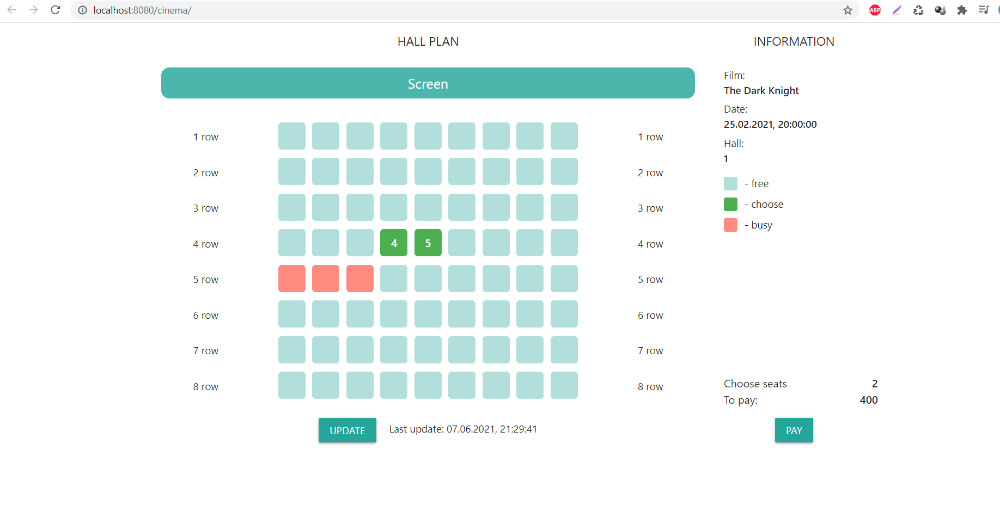
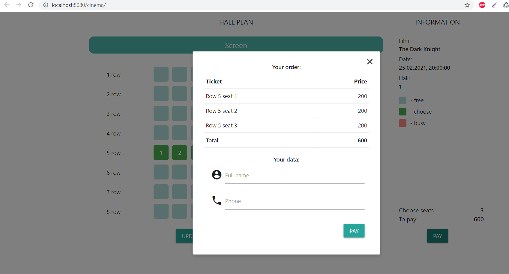
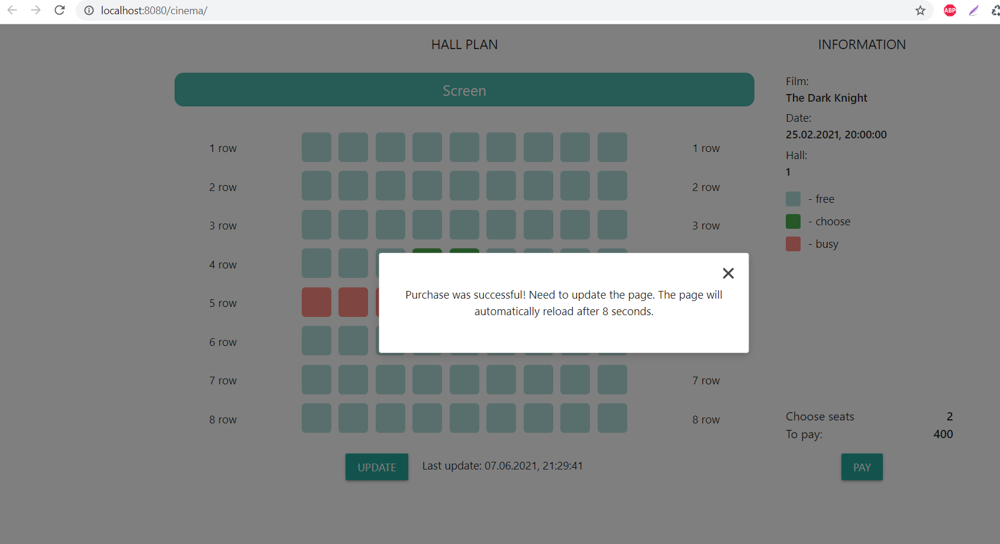

# cinema

Cайт по покупке билетов в кинотеатр.

# О проекте
## Описание
Проект для изучения Java EE.

Это приложение - часть сервиса по онлайн бронированию билетов в кинотеатр.
Посетителю предоставляется возможность выбрать места в зале кинотеатра и оплатить их. Также есть возможность обновлять схему зала для получения клиентом актуальной информации о доступных к покупке местах. Реализован функционал по регистрации пользователей на основе введенных данных о покупателе.

# Технологии
* Java 15
* Java EE Servlets
* PostgreSQL, JDBC, Liquibase
* Maven, Tomcat
* HTML, JavaScript, jQuery, JSON
* [Material Design library](https://materializecss.com/)

# Схема зала
При заходе на страницу асинхронно с сервера загружаются данные о текущем киносеансе. На странице отображается схема зала с указанием занятых и доступных к покупке мест и общая информация о сеансе. При выборе интересующих мест отображается общая информация о стоимости покупки.

# Покупка билетов
После того как пользователь нажал кнопку "оплатить", открывается форма оплаты. В форме подробно описан заказ и его итоговая стоимость, также предлагается ввести данные покупателя для совершения операции.

После заполнения формы, данные отправляются на сервер, результат обработки покупки будет выведен пользователю в том же окне. После чего, спустя некоторое время, страница будет перезагружена для актуализации информации о доступных билетах

